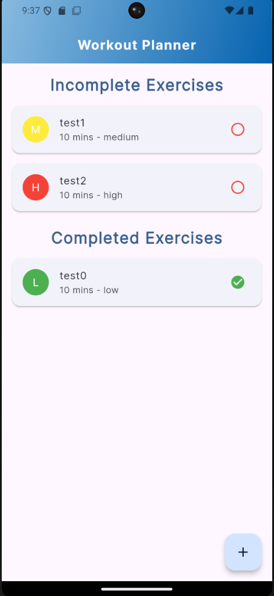
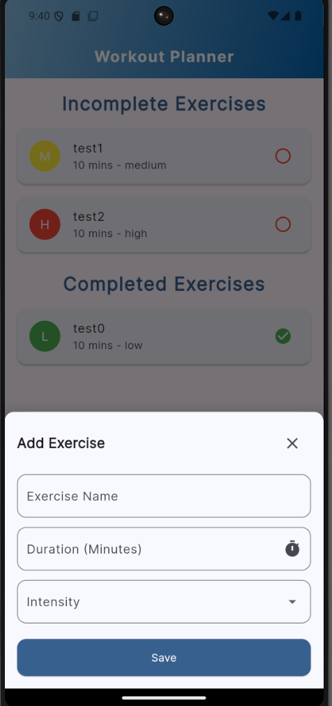
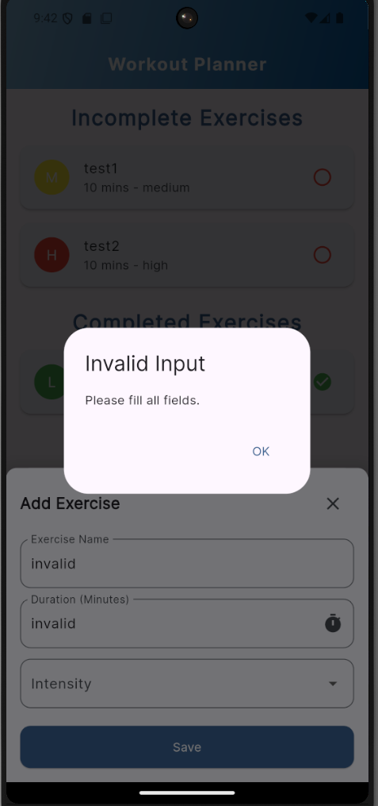

# Workout Planner

A simple and user-friendly mobile application to plan, track, and manage your workout exercises.

---

## 📱 Screenshots

Here are some screenshots demonstrating the app's functionality:

### 1. Home Screen  
Displays the list of incomplete and completed exercises.  


### 2. Add Exercise Screen  
Allows the user to add a new exercise with details like name, duration, and intensity.  


### 3. Invalid Input Alert  
Shows an alert when the user tries to submit incomplete or invalid exercise data.  

 

---

## 🚀 Features
- Add new exercises with name, duration, and intensity.
- Mark exercises as **complete** or **incomplete**.
- Swipe to **delete** exercises easily.
- Exercises are displayed in two categories:
  - **Incomplete Exercises**  
  - **Completed Exercises**
- Smooth and responsive UI with animations.
- Custom UI design using Material Design principles.

---

## 🛠 Technologies Used
- **Flutter**: UI toolkit for building natively compiled applications.
- **Dart**: Programming language optimized for mobile.
- **Google Fonts**: Custom fonts for a polished UI.
- **Material Design**: Modern and intuitive UI components.

---

## ⚙️ Installation

Follow these steps to get the app running on your local machine:

1. Clone the repository:
   ```bash
   git clone https://github.com/firat9/workout_planner.git
   cd workout_planner

---

## 📂 Project Structure

Here is an overview of the project's folder and file structure:

workout_planner/
├── assets/
│   ├── screenshots/         # Screenshots used in the README
├── lib/
│   ├── models/              # Data model classes
│   │   ├── exercise.dart    # Exercise model with attributes like title, duration, etc.
│   ├── widgets/             # Reusable widgets
│   │   ├── exercise_list.dart      # Widget to display exercises (Completed/Incomplete)
│   │   ├── new_exercise.dart       # Form for adding a new exercise
│   │   ├── exercise_mainscreen.dart # Main screen with exercise list and add functionality
│   ├── utils/
│   │   ├── constants.dart   # App-wide constants (colors, paddings, etc.)
│   ├── main.dart            # Application entry point
├── pubspec.yaml             # Flutter dependencies and asset configurations
└── README.md                # Project documentation (this file)

